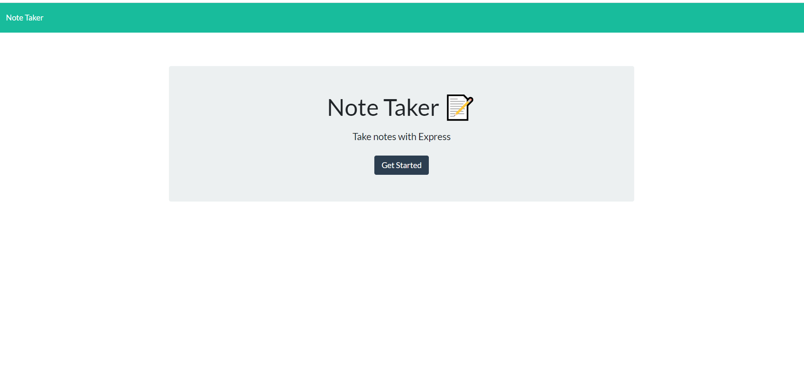
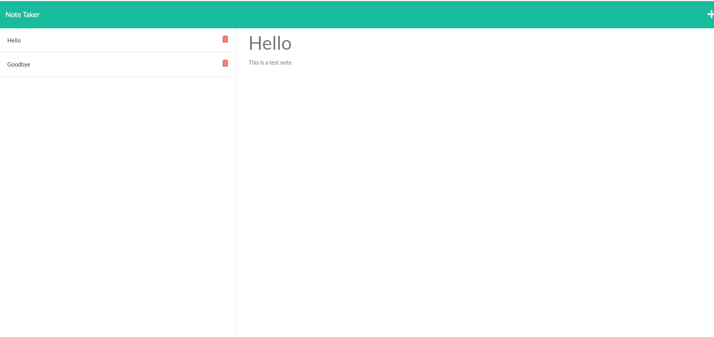

# Note Taker

## Description
Note Taker was created to allow the user to be able create and delete notes, that will carry on to their future visits. 

## Table of Contents (Optional)
* [Installation](#installation)
* [Usage](#usage)
* [Credits](#credits)
* [License](#license)
* [Contributing](#contributing)
* [Test](#test)
* [Questions](#questions)

## Installation
Clone the repo, then install the dependencies (express) and run the server (localhost:3001). 

## Usage
This is what it will look like on your device. 

[Production Link](https://agile-river-98881.herokuapp.com/)

   

## Contributing
Jennifer Lucas 

## Tests 
N/A

## Questions
Please checkout my [Github](https://github.com/jenmlucas) for other projects. If you have any other questions or concerns, feel free to email me at jenmlucas1@gmail.com.

